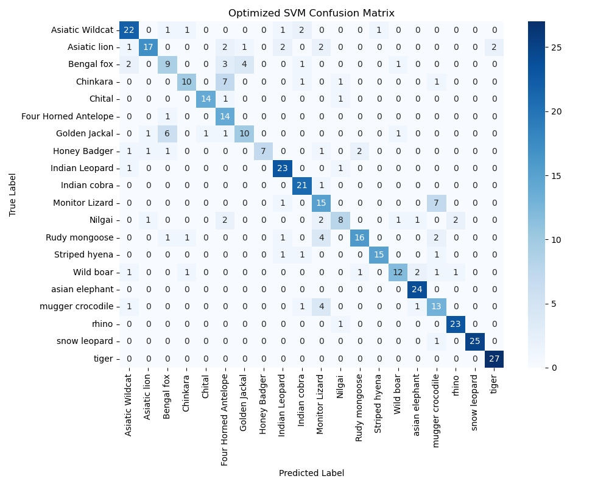
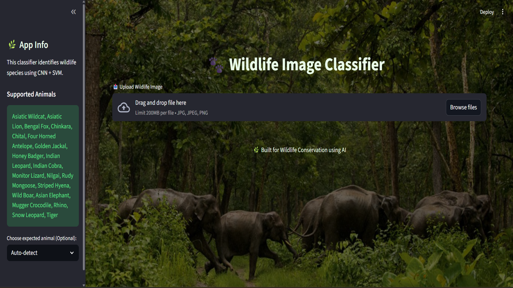
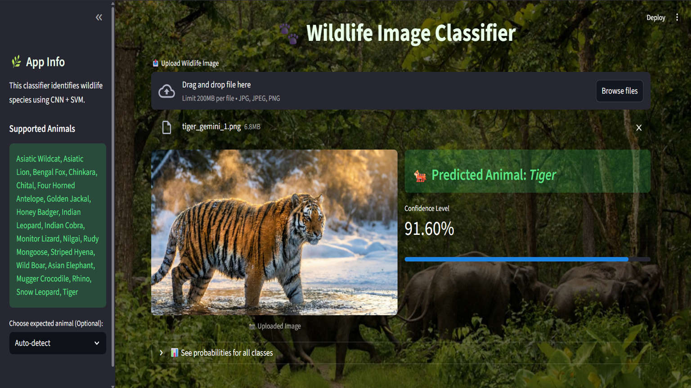

# 🐅 Indian Wildlife Image Classification

A machine learning project that classifies Indian wildlife species from images using **CNN (ResNet50)** for feature extraction and **SVM** for classification, deployed with **Streamlit**.

The ResNet50-SVM model was developed as a requirement for the PG-DBDA course. The model was trained utilizing publicly accessible datasets. The dataset comprised images of diverse wild animals native to India.

Feature Extraction with ResNet: A pre-trained ResNet model (typically ResNet-50 or ResNet-101), renowned for its robust deep learning architecture, is employed as the backbone network. The initial layers of the ResNet model autonomously extract pertinent visual features (such as textures, shapes, and patterns) from wildlife images (e.g., those captured by camera traps). The highly deep architecture of ResNet facilitates the mitigation of vanishing gradient issues and enhances efficacy in feature extraction.

Classification with SVM: Rather than employing the standard Softmax layer at the conclusion of the ResNet for classification, the extracted features are input into an independent Support Vector Machine (SVM) classifier. Support Vector Machines are powerful machine learning algorithms frequently employed for reliable classification tasks when provided with high-quality features.
---

## 🔍 Overview

- Uses **ResNet50** (pre-trained CNN) to extract image features
- Uses **Support Vector Machine (SVM)** for classification
- Achieves **~88% accuracy**
- Deployed as a **Streamlit web application**

---

## 🧠 Technologies Used

- Python
- TensorFlow / Keras
- Scikit-learn (SVM)
- NumPy, Pandas
- Matplotlib
- Streamlit

---

## 🦁 Dataset

- Indian Wildlife Dataset (Camera-trap images)
- 20 wildlife species
- Real-world variations (lighting, background, angle)

---

## 📊 Model Performance

- **Accuracy:** ~88%
- **F1-score:** ~78%

---

**Confusion Matrix:**



---

## 🌐 Web Application

- Upload wildlife image
- Predict animal species
- Simple and user-friendly Streamlit interface

---

## 🖥️ Streamlit Application UI





---

## 🚀 How to Run

```bash
git clone https://github.com/your-username/indian-wildlife-classification.git
cd indian-wildlife-classification
pip install -r requirements.txt
streamlit run streamlit_2.py
```

## 📁 Project Structure

```text
├── dataset/
├── cnn_feature_extractor_resnet_final.h5
├── svm_model_resnet_final.joblib
├── train_cnn_svm_resnet50_final.py
├── streamlit_2.py
├── confusion_matrix_heatmap_final.png
├── requirements.txt
└── README.md
```

---
